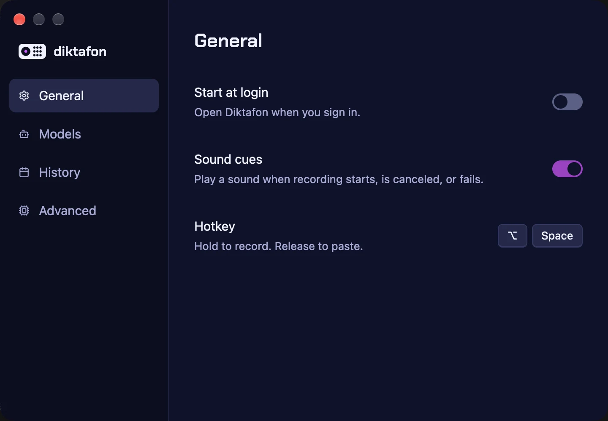

<p align="center">
  
</p>

<h1 align="center">diktafon</h1>

<p align="center">
  Local-only dictation for macOS: hold Option+Space, speak, release,<br>
  and polished text is pasted into the frontmost app.
</p>

<p align="center">
  <a href="https://github.com/infomiho/diktafon/actions/workflows/ci.yml"></a>
</p>



## Features

- Hold Option+Space to record, release to transcribe and paste
- On-device speech with Canary 1B Flash or Cohere Transcribe
- An optional cleanup pass that removes fillers and fixes punctuation
- A menu bar app with no dock icon and no window to manage
- Selectable local model pipelines, hotkey, and sound cues

## Built With

**Rust** + **GPUI** + **transcribe.cpp** + **llama.cpp** + **CPAL**

The interface is built on GPUI, speech runs on-device through transcribe.cpp,
and the cleanup pass runs through llama.cpp.

## Install

1. Download the latest DMG from [Releases](https://github.com/infomiho/diktafon/releases/latest).
2. Open the DMG and drag diktafon into Applications.
3. Launch diktafon and grant Microphone access, plus Accessibility for the paste.

Release downloads are signed with Developer ID and notarized by Apple.

## Models

- Speech-to-text: [Canary 1B Flash](https://huggingface.co/nvidia/canary-1b-flash) by default, or Cohere Transcribe, running on-device via transcribe.cpp.
- Cleanup pass: [S1-mini by Superwhisper](https://huggingface.co/superwhisper/s1-mini) removes fillers and false starts, fixes punctuation, and normalizes numbers, dates, and emails.
- Licenses and model attribution: [third-party notices](THIRD_PARTY_NOTICES.md).

## Run From Source

Building requires Rust 1.97+ and full Xcode (the Apple Intelligence bridge is
compiled with `swiftc`). Then:

```sh
cargo run -p diktafon
```

The client auto-spawns the daemon. To bundle a local app so macOS attaches
Microphone and Accessibility permissions to the app itself:

```sh
./scripts/bundle.sh
open target/diktafon.app
```

## Releases

Version tags publish a signed and notarized DMG with a SHA-256 checksum on the
[releases page](https://github.com/infomiho/diktafon/releases). Installed
copies check that page for updates once a day through Sparkle and install them
in place. Maintainers set up the signing secrets once with
`scripts/setup-release-signing.sh` and the update key with
`scripts/setup-sparkle-key.sh`.
